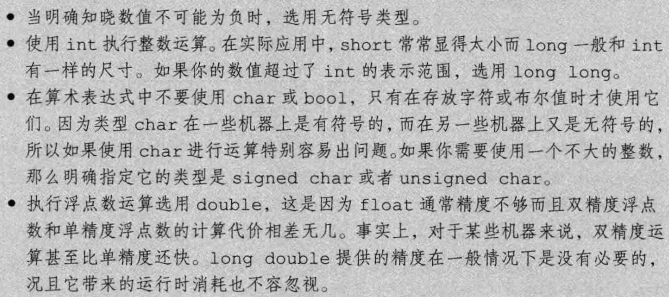
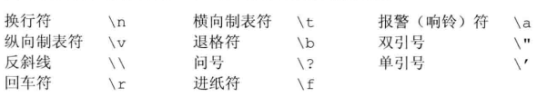

# C++ Primer随记

## 第一章 开始

### 1.2 初识输入输出

标准库定义了四个IO对象，包括cin(标准输入)、cout(标准输出)、ceer(输出警告和错误信息)以及clog(输出程序运行时的一般性信息)

`ctrl+D #终止程序输入`

## 第一部分 C++基础

### 变量和基本类型



---
在进行类型转换时，如果赋给带符号类型一个超出它表示范围的值，结果是未定义的(undefined)，对程序的工作有很大影响，可能继续工作、可能崩溃，也可能生成垃圾数据;
当算数表达式中既有无符号数又有int值时，int值会被转换成无符号数：
``` cpp
    unsigned u = 10;
    int i = -42;
    std::cout << i+i << std::endl; //输出-84
    std::cout << i+u << std::endl; //如果int是32位，输出4294967264
```
同样无符号数做减法时也要注意结果不是一个负值，切忌混用unsigned类型和带符号类型

---
C++规定的转义字符包括：


---
*初始化*
创建对象时对象获得了一个特定的值，这个对象就被初始化了，但初始化并不是赋值，虽然两者都是用=实现，但初始化的含义是创建变量时赋予其一个初始值，而赋值的含义是把对象当前的值擦除，用一个新值来替代
*列表初始化*
在C++11中可以使用花括号来初始化变量，这种初始化的形式被称为列表初始化，共有四种方式，如果使用列表初始化丢失信息时其中两种方式编译器会报错，另外两种不会：
```cpp
long double ld = 3.14;
int a{ld}, b = {ld}; //报错转换无法执行，因为丢失了信息
int c(ld), d = ld; //无报错转换执行，但也确实丢失了部分值
```
---
*引用*
`int &b = a; //将a的地址赋予b，让b变成a的别名，&b表示的是a和b的地址信息`
*指针*
`int val = 42; int *p = &val; //将val的地址赋予p，*p获得了val的值`
*和&两者相互转换组成复合类型，&是取地址符，×是解引用符
如果想要生成一个空指针(null pointer)不指向任何对象，共用以下几种方法：
```C++
int *p0 = 0;
int *p1 = nullptr; //和int *p1 = 0;等价
int *p2 = 0; //将p2初始化为常量0
int *p3 = NULL; //需要#include <cstdlib>
```
*void* 指针*
void*是一种特殊指针类型，可以存放任何对象的地址，但int*指针只能存放int对象的地址

*const限定符*
const对象初始化之后无法被改变，如果改变将引发错误，const对象仅在文件内有效，在多个文件中出现同名const变量时，它们是相对独立的变量。
如果想要在文件之间共享，需要对const变量的声明和定义添加extern关键字，这样就可以在多个文件中使用：
```cpp
extern const int bufSize = fcn(); //在file_1.cc中定义并初始化
extern const int bufSize; //在file_1.h中的声明，和.cc文件中是同一个
```


